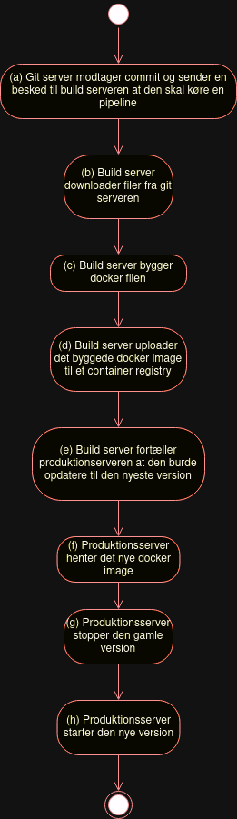

# Deployment optimering

Der er nogle modsigelser i vores nuværende development cycle hos MySKOV.

Det er i udviklerens interesse at teste produktet i produktions-lignende miljø, til det er der blevet opsat et testmiljø der ligner produktionsmiljøet.

Det tager dog alt mellem 5 og 30 minutter at deploye til vores test miljø, hvilket gør at udvikle på testmiljø (kontra at udvikle på lokalt miljø) både frustrerende og tidskrævende.

Jeg vil derfor gerne 
- undersøge optimeringer 
- opsætte et lignende testmiljø
- tage statistik
- implementere de forbedringer
- reflektere på forskellen

Fra noget kode bliver uploaded fra en git klient (f.eks. udvikleren's pc) fra det er oppe og køre på en server, sker dette:



Vi kan hurtigt se et par ting der muligvis kan optimeres:

1. I (b) skal build serveren downloade filerne fra en git server. Hvis det git projekt har mange store statiske filer der ikke ændrer sig ofte, f.eks. billeder eller videoer, skal den også hente de filer ned selv om den egentligt kun har brug for koden. Billederne kunne i stedet være på f.eks. et seperat CDN.
2. I (c) - hvis build serveren's hardware ikke er optimeret til dets arbejde, f.eks. hvis pengene gik til GPU kræft og hvad man réelt set skal bruge er CPU kræft, er det naturligvist langsomt - dog ejer jeg ikke nok hardware til at kunne lave en analyse af forskellen.
3. I (d) og (f) - hvis docker filen er naïvt skrevet og f.eks. inkluderer kode eller kompileringsartifakter som ikke er relevant til at programmet kan køre, skal alt det information stadigvæk sendes over netværket.
4. I (h) - hvis man bruger et sprog med forholdsvis tung runtime, f.eks. Java, C#, eller Node, skal man vente på at runtimen starter

Det er dog meget abstrakt, så jeg vil gerne kunne opsamle statistik så jeg empirisk kan vurdere hvor stor forskel det ene eller andet gør.

Til det formål har jeg opsat et eksempel web projekt med et kendt web framework i programmeringssproget Rust, som har en relativ høj kompileringstid men en meget tynd runtime, og et eksempel projekt i et kendt web framework med Node runtimen og TypeScript programmeringssproget, som burde have en relativt lavere kompileringstid men en større runtime.

Dette projekt bliver så indepakket i en docker container, for at ligne hvordan vi gør det hos MySKOV.

Dockerfilen ligner således dette:

```
FROM rust:1.76

WORKDIR /work

COPY . .

RUN ["cargo", "build", "--release"]

CMD ["/work/target/release/teknikfagsprojekt"]
```

Til at starte med tager dette projekt 181.8s at bygge, og fylder 2.51gb.

Dette billede bliver uploaded til et docker image repository.
